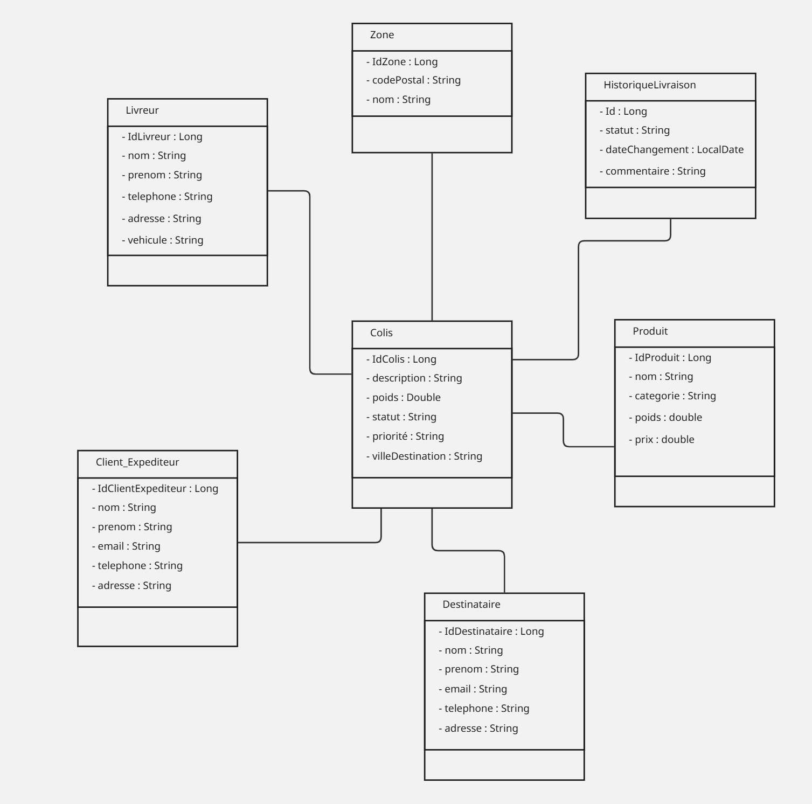

# Smart Delivery Management System (SDMS)

Smart Delivery Management System (SDMS) est une application web développée pour la société **SmartLogi**, spécialisée dans la livraison de colis à travers le Maroc. Cette application vise à moderniser et automatiser la gestion des opérations logistiques, en remplaçant la gestion manuelle via Excel et registres papier.

## Objectifs

- Centraliser la gestion des **clients expéditeurs**, **destinataires**, **colis**, **livreurs** et **zones de livraison**.
- Suivre le flux complet des colis : collecte, stockage, planification, livraison finale.
- Permettre une recherche et un suivi précis des colis selon **ville, zone, statut ou priorité**.
- Fournir un historique complet pour la traçabilité.
- Optimiser l’organisation des tournées et réduire les retards.
- Faciliter la prise de décision pour les gestionnaires logistiques.

## Utilisateurs

| Rôle | Fonctionnalités principales |
|------|-----------------------------|
| **Gestionnaire logistique** | Planifier les tournées, assigner les colis aux livreurs, filtrer et paginer les informations, consulter l’historique complet. |
| **Livreur** | Voir la liste de ses colis assignés, mettre à jour le statut des colis (collecté, livré). |
| **Client expéditeur** | Créer des demandes de livraison, suivre ses colis, recevoir des notifications (optionnel). |
| **Destinataire** | Consulter le statut des colis destinés et savoir quand les recevoir. |

## User Stories

**Client expéditeur**
- Créer une demande de livraison.
- Suivre les colis en cours et livrés.
- Recevoir des notifications (bonus).

**Destinataire**
- Consulter le statut des colis qui lui sont destinés.

**Livreur**
- Voir ses colis avec priorité et zone.
- Mettre à jour le statut des colis.

**Gestionnaire logistique**
- Voir toutes les demandes et les assigner aux livreurs.
- Corriger ou supprimer des informations erronées.
- Filtrer, trier et paginer les colis.
- Regrouper les colis par zone, statut ou priorité.
- Rechercher colis, clients ou livreurs par mot-clé.
- Calculer le poids total et le nombre de colis par livreur et par zone.
- Identifier les colis en retard ou prioritaires et recevoir une alerte (bonus).
- Associer plusieurs produits à un colis.
- Consulter l’historique complet des colis.

## Modèle métier / Tables principales

- **ClientExpéditeur** : id, nom, prénom, email, téléphone, adresse
- **Destinataire** : id, nom, prénom, email, téléphone, adresse
- **Livreur** : id, nom, prénom, téléphone, véhicule, zoneAssignée
- **Colis** : id, description, poids, statut, priorité, idLivreur, idClientExpéditeur, idDestinataire, idZone, villeDestination
- **Zone** : id, nom, codePostal
- **HistoriqueLivraison** : id, idColis, statut, dateChangement, commentaire
- **Produit** : id, nom, catégorie, poids, prix
- **Colis_Produit** : idColis, idProduit, quantité, prix, dateAjout

## Exigences techniques

- **Backend** : Spring Boot (API REST)
- **Base de données** : PostgreSQL, versionnée et migrée via Liquibase
- **DTO / MapStruct** : échanges entre entités et API
- **Documentation API** : Swagger / OpenAPI
- **Logs** : SLF4J
- **Validation** : @Valid, @NotNull, @Size …
- **Pagination & tri** : pour toutes les listes importantes
- **SMTP** : pour l’envoi d’emails (bonus)
- **Configuration** : YAML
- **Gestion de projet** : Maven, Git/GitHub, suivi Jira

## la diagramme des classes

